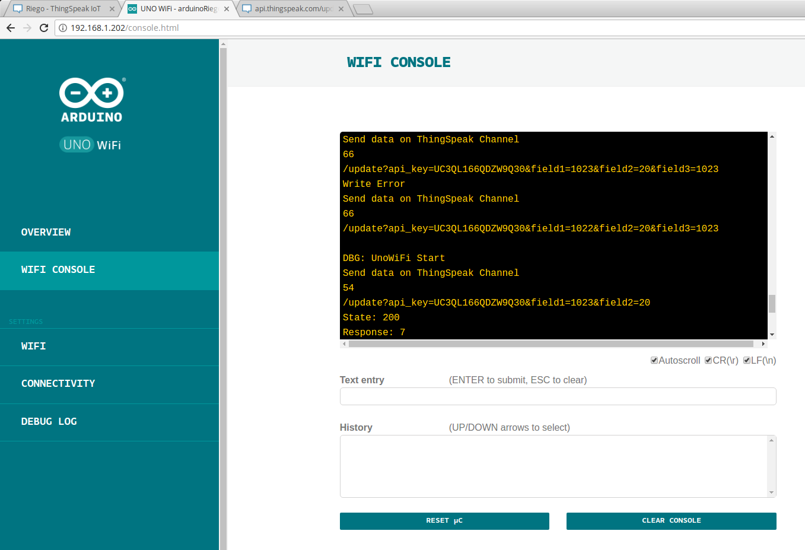

# Publicación en ThingSpeak

ThingSpeak es una servicio web que nos permite publicar datos de las medidas de nuestros dispositivos IOT (o de cualquier otro).

Es gratuito para cierto número de datos y nos permite de manera muy sencilla subir datos

## Creación del canal (Channel)

* Nos hacemos una cuenta en ThingSpeak, recibiremos un email y lo verificamos

* Entramos en Channels->My Channels y pulsamos en "New Channel"

* Configuraremos el canal, indicando los datos que se van a enviar. Podemos añadir una descripción y datos como la web, canal de youtube, etc...

* Para poder enviar datos al canal necesitamos el API KEY que lo identifica que incluiremos en nuestro código

* Para que cualquiera pueda ver los datos, podemos hacer que el canal sea público, desde la pestaña Sharing

* Una vez creado el canal podemos configurar los detalles de cada gráfico, para lo que pulsaremos sobre el icono "lapiz" de cada uno

* En cualquier momento podemos importar/exportar los datos de un gráfico dado

## Código Arduino

Para subir datos usaremos la librería ciao de Arduino UNO Wifi y haremos una petición a su web construyendo una URL con nuestra API Key (que hemos obtenido al Canal) y los datos.

Un código básico sería algo así:

    /* ==== Includes - Librerias==== */
    #include <Wire.h>
    #include <UnoWiFiDevEd.h>

    /* ====  END Includes ==== */

    /* ==== Defines - Constantes ==== */
    #define CONNECTOR     "rest"
    #define SERVER_ADDR   "api.thingspeak.com"
    #define intervalo     30000

    #define APIKEY_THINGSPEAK  "UC3QL166QDZW9Q30" //Insert your API Key

    #define SERIAL_BAUD     9600

    #define MSG_WRITE_ERROR    T("Write Error")

    /* ==== END Defines ==== */

    /* ==== Variables Globales ==== */
    long lIntervaloMedida=2000;  // Para un sistema real sería no menos de un minuto
    long lUltimaMedida=0;
    /* ==== END Global Variables ==== */

    /* ==== Funciones a usar - Prototipos ==== */

    /* ==== END Prototypes ==== */

    /* ==== Setup - Configuracion==== */

    void setup_Serial(){
      Serial.begin(SERIAL_BAUD);
    }

    void setup_nube(){
      Ciao.begin(); // CIAO INIT
    }

    void setup() {
      setup_Serial();
      setup_nube();
    }
    /* ==== END Setup ==== */

    /* ==== Loop - Codigo que se repite==== */

    void publica_datos(){
      String uri = "/update?api_key=";
      uri += APIKEY_THINGSPEAK;
      uri += "&field1=";
      uri += String(hum);
      uri += "&field2=";
      uri += String(temp);
      uri += "&field3=";
      uri += String(pres);
      Ciao.println(T("Send data on ThingSpeak Channel"));
      Ciao.println(uri);
      CiaoData data = Ciao.write(CONNECTOR, SERVER_ADDR, uri);

      Serial.print(uri);
      if (!data.isEmpty()){
        Ciao.println( "State: " + String (data.get(1)) );
        Ciao.println( "Response: " + String (data.get(2)) );
        Serial.println(data.get(1));
        Serial.println(data.get(2));
      }
      else{
        Ciao.println(MSG_WRITE_ERROR);
        Serial.println(MSG_WRITE_ERROR)
      }

    }

    void loop() {
      if(millis()-lUltimaMedida>lIntervaloMedida){ // Toca Medir
        lUltimaMedida=millis();

        delay(lIntervaloMedida);
      }
    }

Desde la Consola Wifi podemos ver la actividad de red

