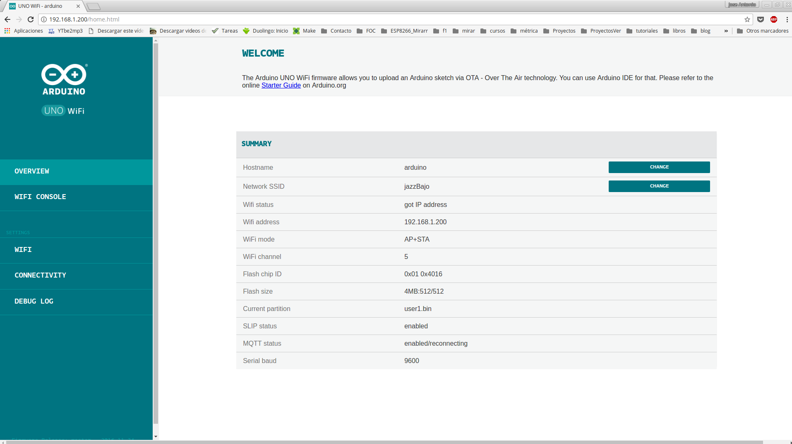
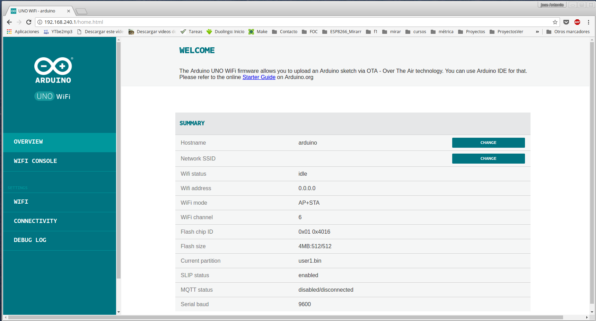
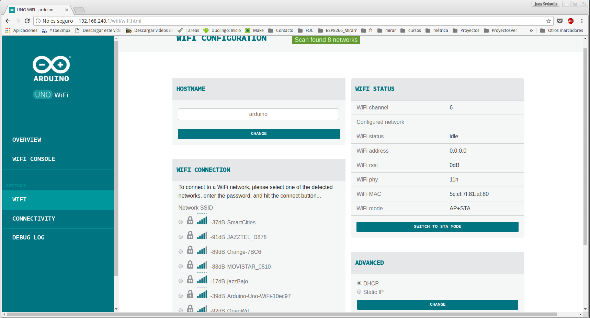
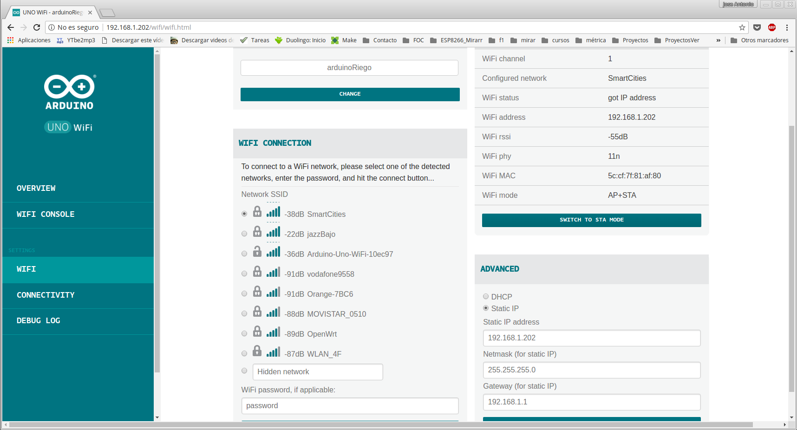
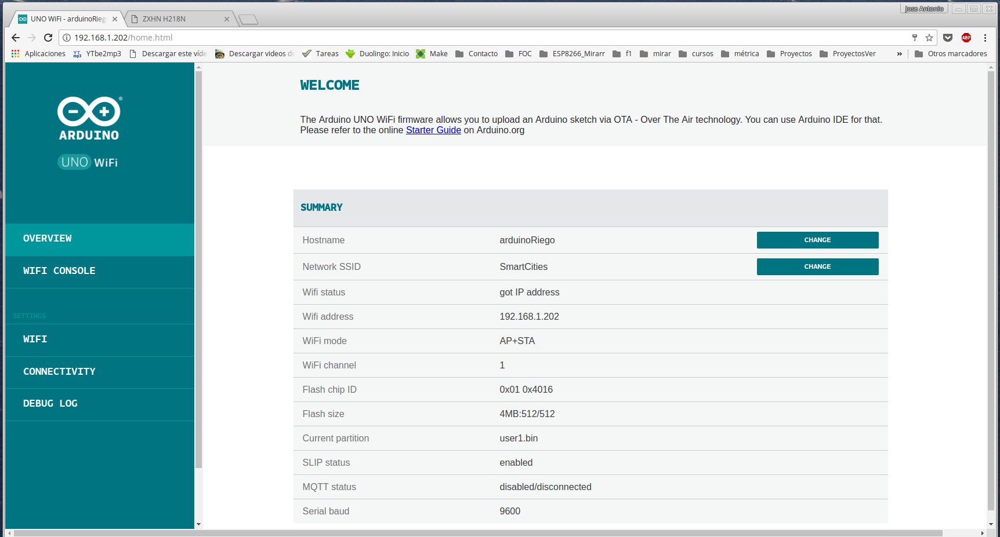
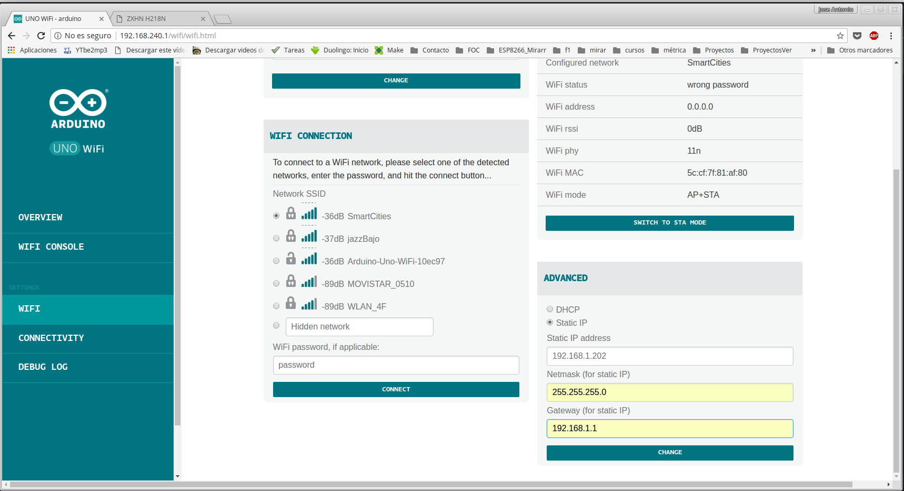

# Wifi

## Configuración del Wifi

[tutorial](http://www.arduino.org/learning/getting-started/getting-started-with-arduino-uno-wifi)

Si es la primera vez:
* Nos conectamos a la red Wifi que genera el propio Arduino que tendrá un nombre similar a Arduino-UNO-Wifi-xxxxxx
* Una vez allí accemos a la ip 192.168.240.1

Si ya lo hemos configurado previamente accedemos a la IP que tenga puesta

Entramos en la sección WIFI
* Seleccionamos la red a la que queremos que esté conectada, introducimos el password y pulsamos Connect
* Si queremos usar IP estática lo seleccionamos en la sección Avanzado y ponemos los datos de conexión

También podemos cambiar el hostname para poder identificarlos más fácilmente

Si tenemos problemas la dirección 192.168.240.1 está siempre disponible, con tal de que nos conectemos a la red Wifi que genera nuestro Arduino

Desde la Consola Wifi podemos ver la actividad de red

## Intalación de la librería Wifi Link

